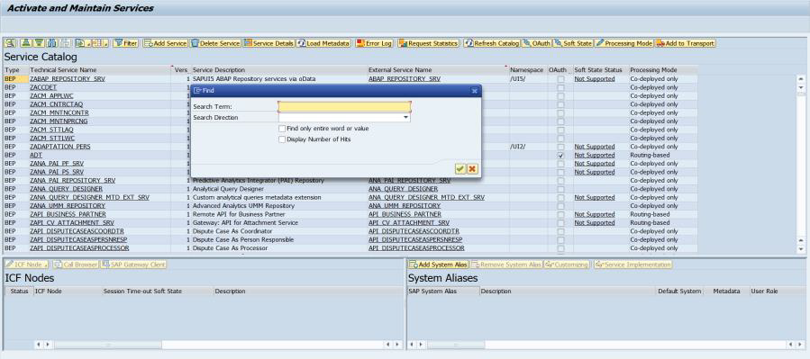
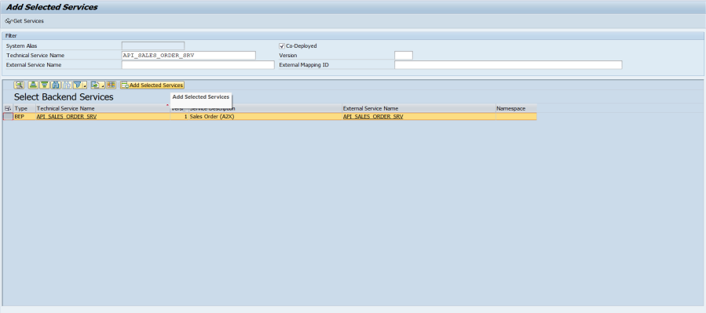
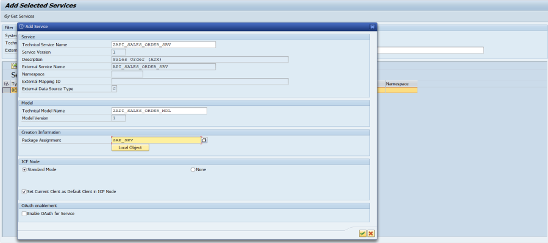
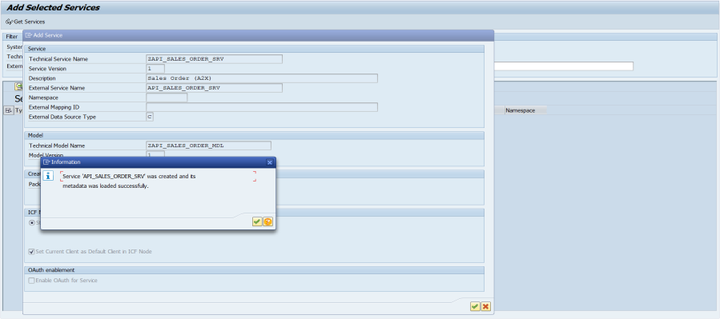
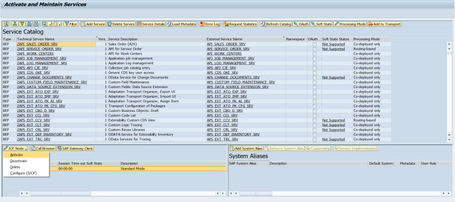
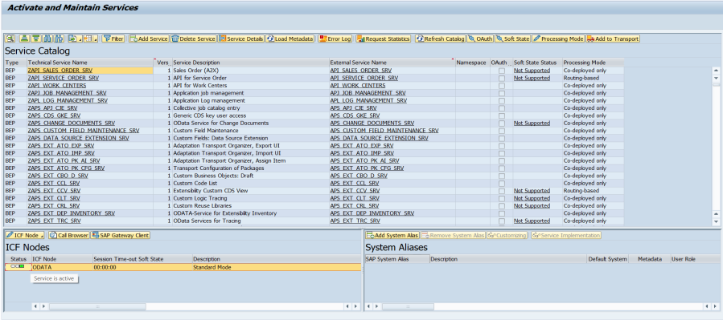
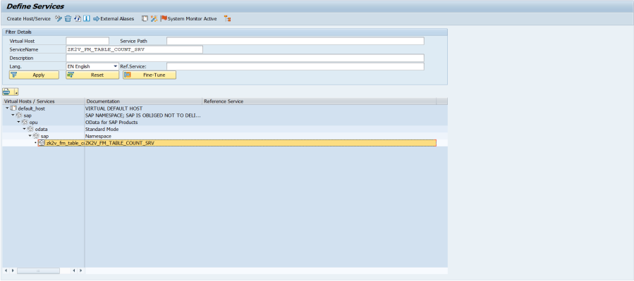
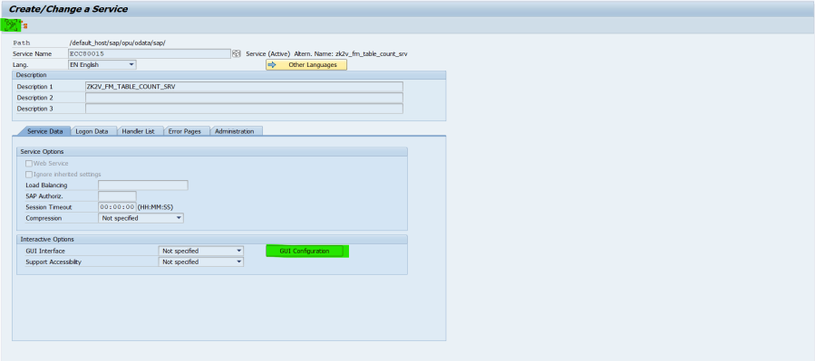

# Post TR Sanity Check

 ## Ensure the OData services are activated
 1. Open the tcode /n/iwfnd/maint_service
 2. Locate the Service using Search option
 
 3. If the Service node is found, proceed to step 8. Else, click on Add Service button to register the service.
 4. Provide service name and click on Enter.
 5. Select the service and click on Add Selected Services.
 
 6. Provide Package Assignment and click on Enter.
 
 7. Make sure changes are saved to TR and Service is registered without any errors.
 
 8. If the service is not activated, click on ICF Node dropdown and click on Activate. By default, the service would be activated when it is registered.
 
 9. Make sure service is added and activated.
 
 10. Repeat the steps [2 to 9] for all OData Services.

 ## Disable CSRF (Recommended)
 Unless specifically needed, it's recommended to disable CSRF token validation in order to avoid extra API calls to fetch/renew the CSRF token.
 1. Open the tcode sicf.
 2. Locate the Service either using Service Name and Execute (F8).
 3. Double click the Service Node.

 4. Click on the change mode, to edit the Service and click on GUI Configuration.
 
 5. Make sure the entry [~CHECK_CSRF_TOKEN, 0] is added to the Parameters.
 6. If the entry is not there, add the entry and save the changes.
 7. Repeat the steps [2 to 6] for all OData Services