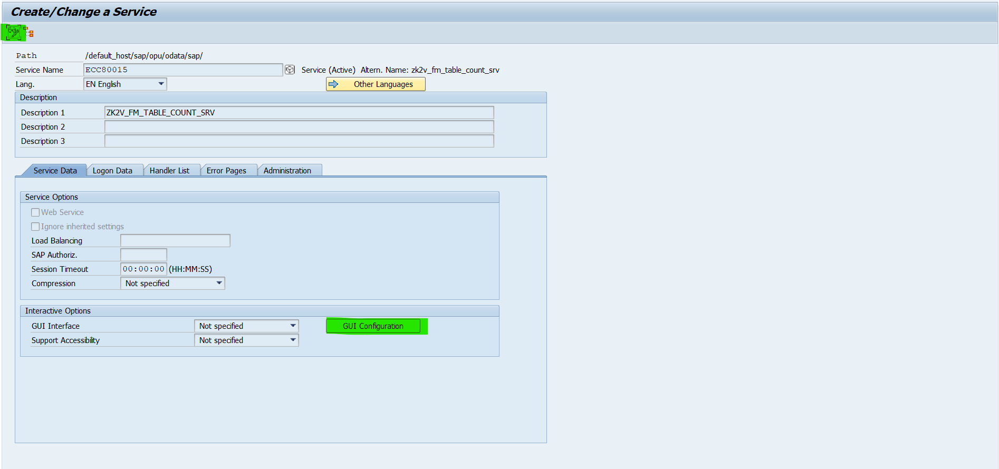

**Sanity Check Document - Post TR Import**

**Steps:**

1.  List of Services

2.  Check if OData services are activated

3.  Ensure the parameter \~CHECK_CSRF_TOKEN is 0 for all services in
    sicf

4.  Ensure Processing mode of OData servivces is correct

**1. List of Services**

1.  Generic APIS

    1.  ZYK2V_FM_TABLE_FIELDS_V2_SRV

    2.  ZYK2V_FM_TABLE_RELS_V3_SRV

    3.  ZYK2V_FM_TABLE_LIST_SRV

    4.  ZYK2V_FM_TABLE_READ_SRV

    5.  ZYK2V_FM_TABLE_MODIFY_V2_SRV

    6.  ZYK2V_FM_TABLE_COUNT_SRV

2.  ERD APIs

    1.  ZYK2V_FM_ERD_GET_TABLE_DATA_V3_SRV

    2.  ZYK2V_FM_ERD_TABLE_MODIFY_V2_SRV

**2. Check if OData services are activated**

a.  Open the tcode ***sicf***

b.  Enter ***Service Name*** and ***Execute (F8)***

c.  Ensure if Service is activated. If the node is enabled, it states
    that the service is active, or else not active.

d.  If the Service node is disabled, Right click on the Service node to
    check if the service is activated click on ***Activate Service***.

e.  Make sure Service is activated without any errors.

f.  Repeat the steps from \[b to e\] for all OData Services

**3. Ensure the parameter \~CHECK_CSRF_TOKEN is 0 for all services in
sicf**

a.  Open the tcode ***sicf***

b.  Enter ***Service Name*** and ***Execute (F8)***

c.  Double click of the Service Node

d.  Click on the ***change mode***, to edit the Service and click on
    ***GUI Configuration***

e.  Make sure the entry \[\~CHECK_CSRF_TOKEN, 0\] is added to the
    Parameters.

f.  If the entry is not there, add the entry and save the changes

Parameter Name - \~CHECK_CSRF_TOKEN

Value - 0

g.  Repeat the steps \[b to f\] for all OData Services

**NOTE:** below step is needed if we see a error - No System Alias found
for Service \'ZK2V_FM_TABLE_FIELDS_V2_SRV_0001\' and user
\'XXXXXXXXX_NN'". Else below step can be skipped.

**4. Ensure Processing mode of OData servivces is correct**

a.  The steps would differ based on the type of the S/4 HANA system.

b.  Hub-based - system where the frontend/gateway system is different
    from the backend. Embedded - system where the frontend/gateway is
    embedded into the backend.

c.  Routing-based is used if we have Hub-based system. So, if we choose
    this option, we must maintain a System Alias in the bottom right
    corner, for the respective service, even if the alias is LOCAL.

d.  Co-deployed only is used if we have Embedded system. So, if we
    choose this option, we don\'t need to add a System Alias.

e.  Open the transaction /N/IWFND/MAINT_SERVICE

f.  Select the service referenced by the error message

g.  Assign the appropriate backend for the OData service by clicking Add
    System Alias in the bottom right-hand pane.

    i.  Remain the Processing Mode of the service as \'Routing based\',
        in this case the system alias LOCAL must be specified for this
        service

    ii. Change the Processing Mode of the service to \'Co-deployed
        only\'

h.  Special case - if a valid system alias is already maintained and the
    error still occurs, try the following approach:

    i.  Open the transaction /IWFND/MAINT_SERVICE in the NetWeaver
        Gateway

    ii. Select the service referenced by the error message

    iii. Set the processing mode to \"Co-deployed only\" with the button
         Processing Mode

    iv. Call the service in the transaction /IWFND/GW_CLIENT

    v.  Set the processing mode back to \"Routing-based\" with the
        button Processing Mode
