# SAP Connector

[Introduction](#description)
- [SAP Broadway Actors](#sap-broadway-actors)
- [SAP LU Tables](#sap-lu-tables)

[Installation](#installation)
- [Requirements](#requirements)
- [Step 1: Install the SAP Connector](#step-1-install-the-sap-connector)
- [Step 2: Install SAP TR Files on Your SAP System](#step-2-install-sap-tr-files-on-your-sap-system)
- [Step 3: Validate SAP System installation](#step-3-validate-sap-system-installation)
- [Step 4: Create and validate SAP DB Interface](#step-4-create-and-validate-sap-db-interface)
    - [Create SAP Interface](#create-an-sap-interface)
    - [Mandatory Parameters for Interface Creation](#mandatory-parameters-for-interface-creation)
    - [Validate the Interface](#validate-the-interface)

[How To Use](#how-to-use)
 - [Step 1: Create Catalog for your SAP tables](#step-1-create-catalog-for-your-sap-tables)
- [Step 2: Run the Catalog’s discovery process](#step-2-run-the-catalogs-discovery-process)
- [Step 3: Add SAP tables to your LU Schema](#step-3-add-sap-tables-to-your-lu-schema)

[Performance considerations](#performance-considerations)
- [Interface Parameters](#interface-parameters)
- [Prefetching in extract actors](#prefetching-in-extract-actors)
- [BW Actor Parameters](#broadway-actor-parameters)

[Changelog](#changelog)

# 

# Introduction

The SAP Connector library is designed to enable seamless integration between K2view and SAP systems.

The connector uses APIs specifically built for the K2view connector, which must be installed on the SAP system.

## SAP Broadway Actors

The library includes the below built-in Actors:

-   **SapTableExtract** - Extracts data from an SAP table.
    -   **Filter Input**: Acts like a WHERE clause in SQL, allowing you to filter the table's records.
    -   **Limit Input**: Restricts the number of extracted records.
-   **SapTableLoad** - Loads data into an SAP table.
    -   **Operation Input**: Determines the operation to perform on the SAP system:
        -   INSERT: Inserts records into the table. If a record with the same primary key already exists, it will be overwritten (equivalent to a delete followed by an insert).
        -   UPSERT: Inserts a new record if it does not exist. If the record already exists, it will be updated.
    -   **Transaction mode:**
        -   SYNC: API calls are executed sequentially.
        -   ASYNC: API calls are executed asynchronously.
-   **SapDelete** - Deletes data from an SAP table based on specified keys.
-   **SapTruncate** - Clears all data from an SAP table.
-   **SapTableQuery** - Used in LU Table population to extract data from a table based on the linking field values in the parent table.
-   **SapSequence** - Fetches the next (or initial) sequence given a number range interval and object.

## SAP LU Tables

To add tables to the LU Schema, use the **DB Explorer**. After running the **Catalog** on the SAP interface, the DB Explorer will display the available tables.

# Installation

## Requirements

#### 

-   **Fabric Version**: 8.1.0 or higher for v1, 8.2.0 for v2.

## Step 1: Install the SAP Connector

1.  Open your Studio and navigate to the **Extensions** section.
2.  Locate the **SAP Connector** extension in the list.
3.  Click **Install** to add it to your project.  
    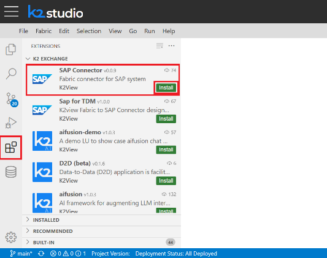

## Step 2: Install SAP TR Files on Your SAP System

1.  In the Studio, navigate to **Project → Project Resources → SAP → TRs**.
2.  Download the appropriate zip file based on your SAP system and namespace:
    1.  **ECC-Z**
    2.  **ECC-ZY**
    3.  **S4HANA-Z**

        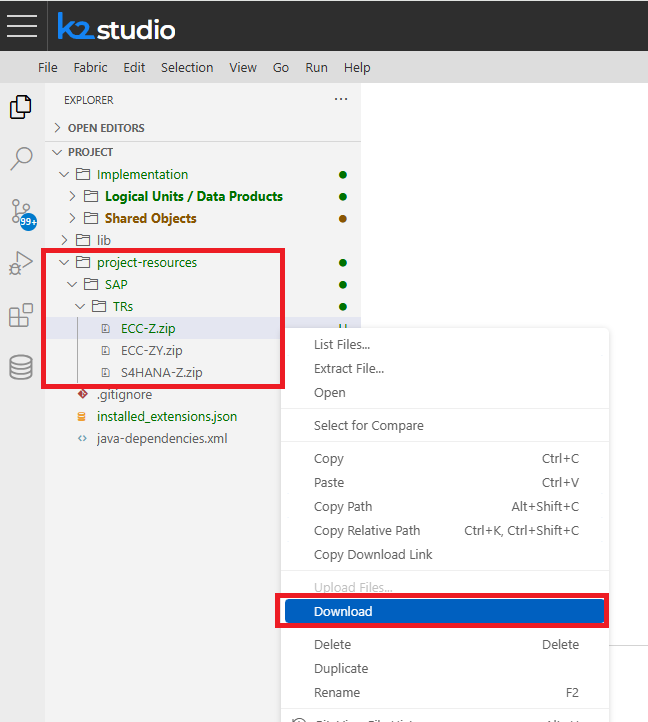

3.  Install the file on your SAP system.

## Step 3: Validate SAP System Installation

Refer to the instructions [here](POST-TR-INSTALLATION.md) to ensure a proper installation of the SAP TR files.

## Step 4: Create and Validate SAP DB Interface

### Create an SAP Interface

1.  In the **Studio**, navigate to **Project → Implementation → Shared Objects → Interfaces**.
2.  Right-click on **Interfaces** and select **New Interface** -  
    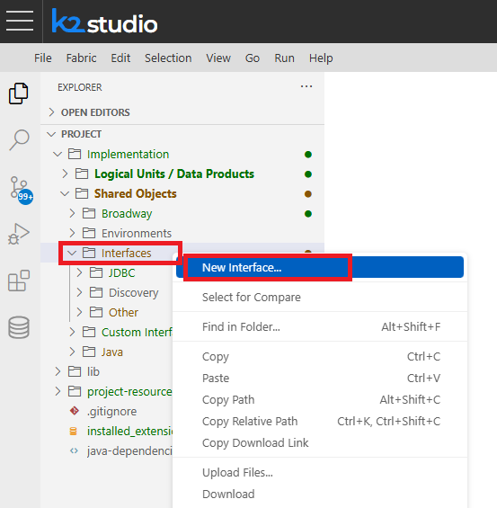
3.  Choose **SAP** as the Interface Type -  
    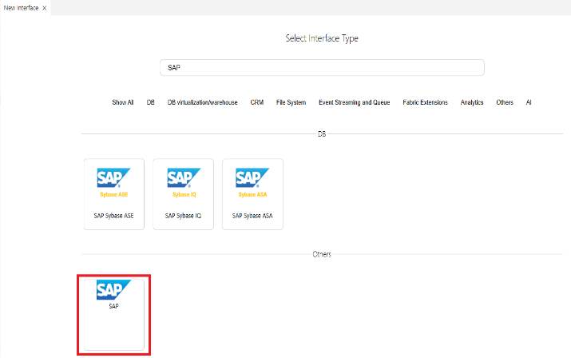
4.  Name the new interface -  
    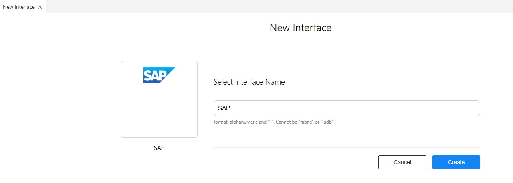
5.  Enter the connection details for the SAP system (refer to the below *Mandatory Parameters for Interface Creation* section).
6.  Save the interface configuration.

### 

### Mandatory Parameters for Interface Creation

#### **Connection Parameters:**

-   **Protocol Type**: HTTP/HTTPS
-   **Host**: SAP system host
-   **Port**: SAP system port
-   **User**: Username for connecting to the SAP system
-   **Password**: Password for the SAP system
-   **SAP Namespace**: SAP namespace
-   **SAP Client**: Sap client id - default is 800.

#### **Security Parameters:**

1.  **Disable SSL Certificate Check**:
    1.  Disables certificate validation for HTTPS connections.
    2.  Checking this parameter allows establishing a connection to a secure server using either a self-signed certificate or a certificate from an untrusted authority.
    3.  **Important**: While this ensures the connection is encrypted, it exposes the system to potential man-in-the-middle attacks. It is strongly recommended to address this issue by installing a certificate, which is both trusted and valid, on the server.
2.  **CSRF Enabled**:
    1.  Set this to **true** if CSRF validation is enabled in the SAP system. When enabled, all API calls to SAP will utilize a CSRF token provided by SAP.  
        **Behavior When Enabled:**
        1.  At the start of each SAP session, an additional API call is made to fetch the CSRF token.
        2.  If the token expires and a **403 CSRF validation error** occurs:
            1.  The token is automatically renewed.
            2.  The error is suppressed, ensuring uninterrupted API communication.

#### **Optional Parameters for Debugging and Data Handling:**

1.  **Debug Logging**:
    1.  When set to **true**, it logs each SAP API call at the INFO level, including the API path, payload and response.
    2.  For more detailed debugging:
        1.  Leave this flag off.
        2.  Configure logback.xml to show DEBUG-level logs from com.k2view.cdbms.usercode.common.sap for more granular information.
2.  **Use String for Date/Time**:
    1.  SAP Date and Time values can be retrieved as either one of these two options:
        1.  Strings in the format "YYYYmmdd" (Date) and "HHmmss" (Time).
        2.  Parsed java.sql.Date and java.sql.Time objects.
    2.  Setting this flag to **true** retains the values as strings.
    3.  **Recommendation**: Enable this flag unless specific database formatting or Date/Time parsing is explicitly required. Enabling this flag would prevent inconsistencies across systems.

#### **Optimization Parameters (Extract/Load):**

-   **Extract Page Size**: Specifies the number of records to fetch in each Extract API call.
-   **Load Batch Size**: Defines the number of records to upload in each Load API call.

### Validate the Interface

In the interface, click **Test Connection** to ensure the connection is functioning as expected.

Testing the connection verifies the connectivity between Fabric and the SAP system, ensuring successful integration.

# How To Use

## Step 1: Create Catalog for your SAP Tables

1.  Navigate to: **Project → Implementation → Shared Objects → Interfaces → Discovery** in Studio.
2.  Open the plugins.discovery file.
    1.  In the data_platforms section, add an entry for the SAP interface, specifying the SAP tables to include in the Data Discovery.
3.  Save the file by pressing **Ctrl + S**.

**Important Notes:**

1.  SAP systems contain many tables. It is mandatory to specify the required tables in the data_platform section in order to avoid processing all tables. This section should not be left empty.
2.  The **Category** property of SAP tables serves as the tables’ schema.
3.  The tables listed in the data_platform must include the schema name (Category). If the Category is unknown, use "\*" as a wildcard to represent the schema.

    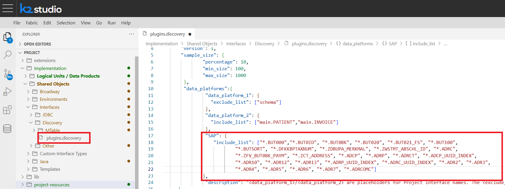

## Step 2: Run the Catalog’s discovery process

#### 

1.  Navigate to **Project → Implementation → Shared Objects → Interfaces → Other** in your studio.
2.  Right-click the SAP interface you intend to run the Catalog on and select 'Run Discovery Job' -

    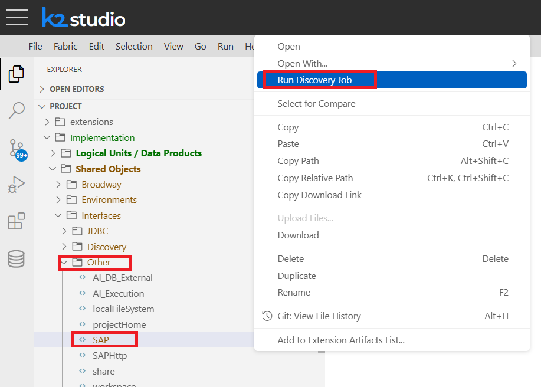

3.  Validate that the Discovery Job has finished, and a new Catalog was created. Expect to see the below pop-up window:

    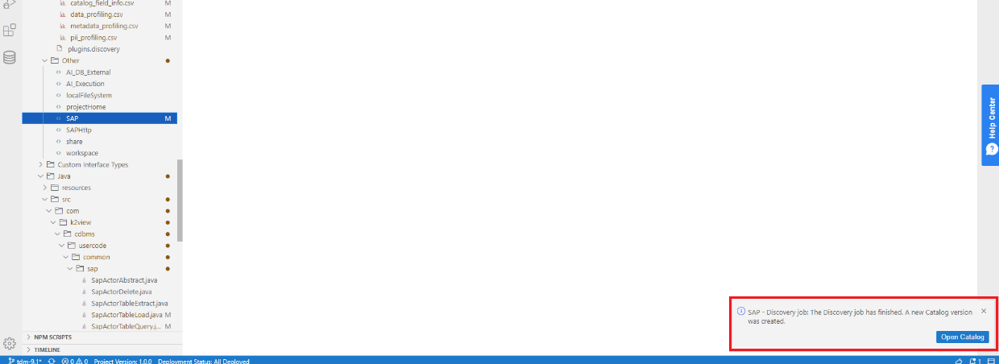

4.  Open the Catalog to see the created relations -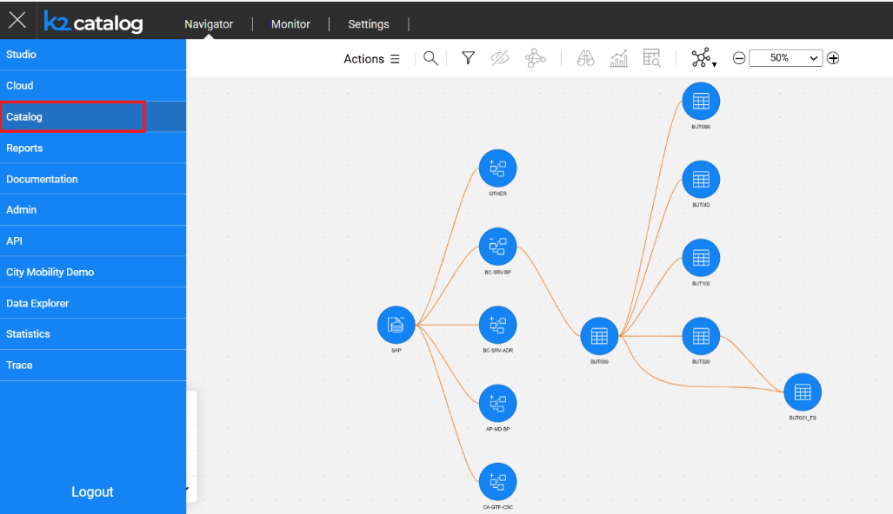
5.  Build the artifacts for the newly generated Catalog -

    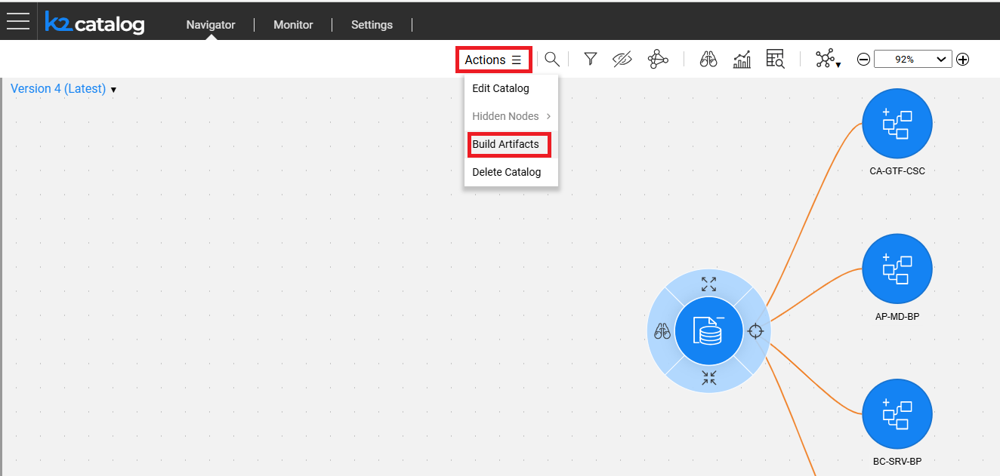

## Step 3: Add SAP Tables to your LU Schema

#### Create a New LU Schema

1.  Navigate to: **Project → Implementation**.
    1.  Right-click on **Logical Units/Data Product** and select ‘**New Data Product (Logical Unit)...’**.
    2.  Name the new Logical Unit (LU) and select the default type.

#### Add SAP Tables to the LU Schema

1.  Open the schema of the newly created LU.
2.  Go to the **INTERFACE EXPLORER** tab.
3.  Open the **SAP Interface** and locate the root table.
4.  Right-click on the root table and select **Add Table to Schema with Descendants**.

    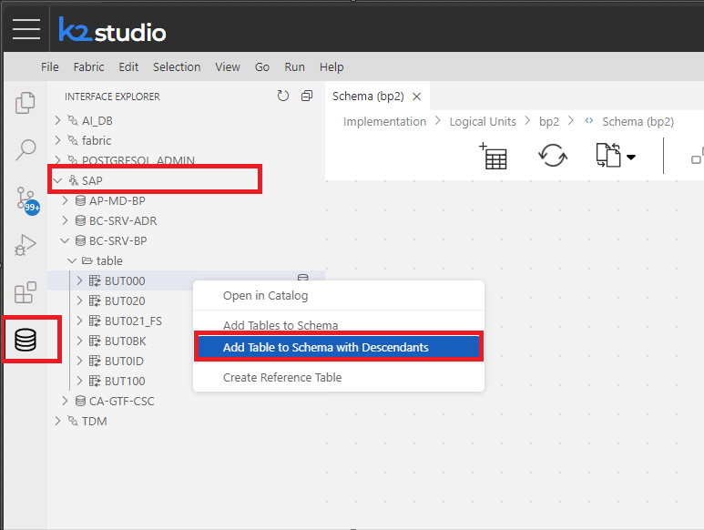

    This action will include the root table along with its related tables in the schema.  
    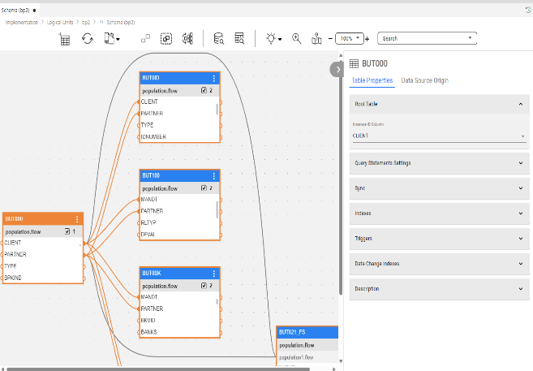

# Performance considerations

## Interface Parameters

The **Extract/Load** section of the interface includes two key parameters that impact performance:

1.  **Extract Page Size**:
    1.  Specifies the number of records to request in each API extract call.
2.  **Load Batch Size**:
    1.  Defines the number of records to load in each API load call. Note that this value may be overridden by the SapTableLoad actor.

These parameters have default values, but they can be adjusted. It is recommended to adjust the values per the table’s number of records and fields, as it would lead to a better performance. For example, when loading data in an ASYNC mode, the **Extract Page Size** parameter’s value should be higher than the **Load Batch Size** parameter’s value.

### Prefetching in Extract Actors

As SAP data is retrieved in pages, a mechanism was added to prefetch the subsequent page as soon as the current one is requested, ensuring it is ready for use with no delay.

## Broadway Actor Parameters

The **SapTableLoad** actor includes performance-enhancing parameters:

1.  **Batch & Batch Size**:
    1.  Set the **Batch** to **true** to enable loading the **Batch Size**’s number of records in each load API call.
    2.  Following the above setting, adjust the **Batch Size** for a better performance (the default value is set in the interface’s **Load Batch Size** parameter).
    3.  Note: If the **Batch** is set to **true**, the stage(s) in the Broadway flow must operate in a **Transaction Mode**.
    4.  Additional improvement option:

        To aggregate the batch records using multiple threads:

2.  Create a new Broadway flow and add the **SapTableLoad** Actor -

    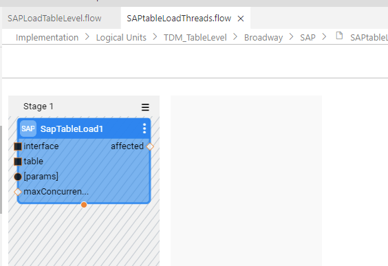

3.  In the original Load flow, call the flow created in step 1 using **InnerFlowAsync** actor.
4.  Configure the number of threads by setting the **threadCount** input in the **InnerFlowAsync** actor. The default value is 0, which allows the system to use as many threads as needed.
5.  Add an **InnerFlowJoin** actor to the flow. Pass the **remaining** and **failures** outputs from the **InnerFlowAsync** actor to the corresponding **remaining** and **failures** inputs in the **InnerFlowJoin** actor. This ensures that the load flow waits for all the threads to complete before it closes.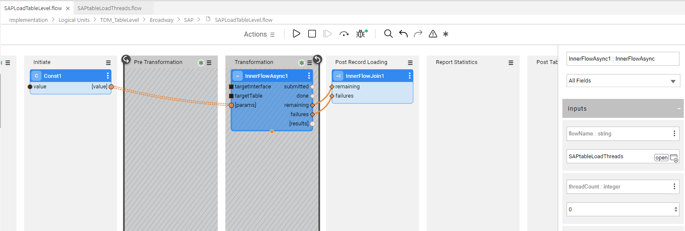
6.  **Transaction Mode**: Controls how API calls are made:
    1.  **SYNC**: API calls are executed sequentially.
    2.  **ASYNC**: API calls are executed asynchronously. During the commit process, the interface ensures that all API calls are successfully completed.
7.  **INSERT Mode**:
    1.  When using **SapTableLoad**, choose **INSERT Mode** whenever possible, for better performance.

# Changelog
## v2.0.1
- Remove validation for minimum required fabric version to allow installing older versions.
## v2.0.0
- Implement crawler rules logic to support Fabric 8.2 (also drops support for Fabric 8.1).

## v1.0.3
### Changed
- Move README to another git repository.
- Precedence of params / special actor inputs in SapTableLoad. Now the value of a special field input takes precedence over the value in _params_ for the same field. 

### Added
- Option in interface to specify the sap client.
- SAP Sequence actor.

### Fixed
- NPE in result.affectedRows() when an error occurs in SAPTableRead actor.
- Proper handling of additional data types (A, E, G, Y) in SapTableRead.

## v1.0.2
- Fixed handling of type INT8.

## v1.0.1
### Fixed
- Resolved an occasional ConcurrentModificationException that occurred during the transition to the next page while cleaning up the current page.

### Changed
- The CSRF token is now stored for each SAP system host instead of each SapConnection, reducing unnecessary CSRF token fetches.

## v1.0.0
### Fixed
- Removed TDMSourceDbQuery dependency in SapTableQuery actor which caused a compilation error.
- Fixed an issue in SapTableLoad of case-sensitivity in the fields names that caused a SapApiException ("Expected the same amount of fields and values"). This happenned when an item in `fields` param did not exactly match a key of `params` map.
- Added an empty batch check in `SapTableLoad` `commit` method to avoid calling the API without any data. This caused an API failure when there's nothing to commit in the last batch. 
- Resolved an issue causing unnecessary extract API calls when closing an inner flow that returns a `SapExtractResult`, by ensuring the same iterator is always returned instead of creating a new one each time.
- Previously, when a field of type `number` was empty, it was incorrectly converted to `0` instead of `null`. This caused issues when the data was reloaded into the same table, as the SAP API failed because `0` is not a valid timestamp (apparently that specific field represented a timestamp in SAP). 
A check has now been added to correctly handle empty values by returning `null`.

### Added
- New actor `SapTruncate` that can truncate a SAP table.
- Multithreading support for batch loading.
- Introduced several new inputs for SapTableLoad actor:
    - `operation` - Allows selection between `INSERT` and `UPSERT`. Previously, the only supported operation was `UPSERT`. The `INSERT` option, which is functionally similar to performing a delete followed by an insert, offers improved performance compared to `UPSERT`.
    - `transactionMode` - accepts one of two predefined values: `SYNC` for synchronous execution, where batch-load APIs are executed one at a time, or `ASYNC` for asynchronous execution, enabling concurrent batch-load API executions.
    - `maxConcurrentApiCalls` (default: 20) applies only in `ASYNC` mode. When the limit is reached, the oldest API call must finish before submitting a new batch. 
- Added support for CSRF validation - can be turned on/off in the interface settings.

### Changed
- Updated the fetching logic in the extraction process to prefetch the next page asynchronously immediately after fetching the current page, ensuring no delay when the next page is requested.
- Refactoring and minor performance enhancements in SapTableLoad actor.
- Values of `params` in SapTableLoad actor now take precedence over additional actor inputs.

## v0.0.9
- Added TR files for S4HANA and ECC (Z/ZY namespaces) systems under project-resources.

## v0.0.8
### Fixed
- Changed catalog field property "Decimal Precision" to "decimalPrecision" following a discovery job failure in Fabric Studio: 8.1.0-14, Fabric: 8.1.1_12.
- Changed the sqlite and catalog data type mapping for date and time to VARCHAR when the flag "Use String for Date/Time" is set. This changes the type of Date/Time fields to TEXT in the LU tables which are created automatically based on the Catalog, as it was failing in the population when trying to insert a string into a Date or Time field. 

## v0.0.7
### Fixed
- Move changelog file content to README due to navigation issue between the files.

## v0.0.6

### Added
- A flag in the SAP interface which provides the ability to treat SAP dates and times as either a string or a java.sql.Date/Time

### Fixed
- Overriding fetch size in the extract actor - was taking it always from the interface.

## v0.0.5

### Fixed
- Enhanced the performance of `SapTableQuery` in case `parentRows` is empty
- Update the result count in `SapTableQuery` to ensure it reflects accurately in the `_k2_objects_info` table.
