# SAP for TDM
- [Description](#description)
- [Installation](#installation)
- [How to upgrade to a new TDM version](#how-to-upgrade-to-a-new-tdm-version)
- [How to use](#how-to-use)
    - [TDMLUInit](#tdmluinit)
    - [TDM Table Level](#tdm-table-level)
    - [Synthetic data](#synthetic-data)
    - [Sequences](#sequences)
        - [How to Use](#how-to-use-1)
        - [Verifying the Sequence Masking Creation](#verifying-the-sequence-masking-creation)

# 

# Description

The *SAP for TDM* library is designed to enable seamless
integration between K2view and SAP systems, by using TDM.

Installing the *SAP for TDM* library will **also** automatically install the *SAP
Connector* library, which includes five built-in actors that are used in the *SAP for TDM* library. Make sure to read the *SAP Connector*
README document as well, as it includes essential information regarding
these actors.

# Installation

## Requirements

Before starting, ensure the following versions are in place:

-   **Fabric version:** 8.1.0 or higher
-   **Studio version:** 8.1.0 or higher
        
    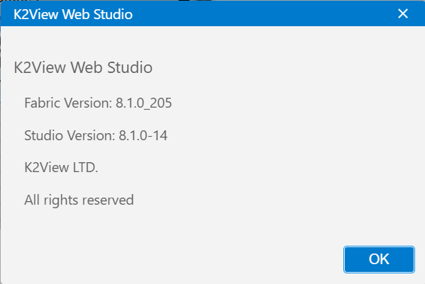

### Step 1: Make sure TDM 9.1.3 is installed

### Step 2: Install *SAP Connector* extension
Install the *SAP Connector* extension from the *K2exchange* tab. Make sure the version is compatible with your Fabric version (v1 for Fabric 8.1, v2 for Fabric 8.2).
> **Note:**
> In *SAP for TDM* v1.0.1 or older, if you don't have the *SAP Connector* extension installed, *SAP for TDM* will install it automatically. However, it will install the latest available version, which may not be compatible with the Fabric version that you are using. Due to the above, we have decided to remove this auto-install feature in the latest *SAP for TDM* extension versions.

### Step 3: Install *SAP for TDM* extension
> **Note:**
> It is crucial to install the *SAP Connector* extension before *SAP for TDM* as the latter might overwrite a file from the *SAP Connector* extension.
1.  Install the *SAP for TDM* extension from the K2Exchange tab.
2.  If you get a conflict warning, similar to the one shown below, then choose 'Overwrite All'.
    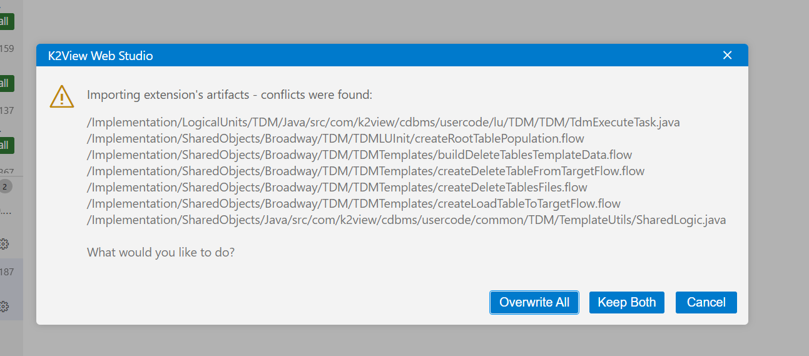
3.  Deploy the TDM LU.
4.  Create SAP interface and test it:
    1) Navigate to the Project Tree -\> Implementation -\> Shared Objects -\>
    Interfaces.
    2) Right-click on 'Interfaces' and select 'New Interface'.
    3) Select the 'SAP' interface type -
    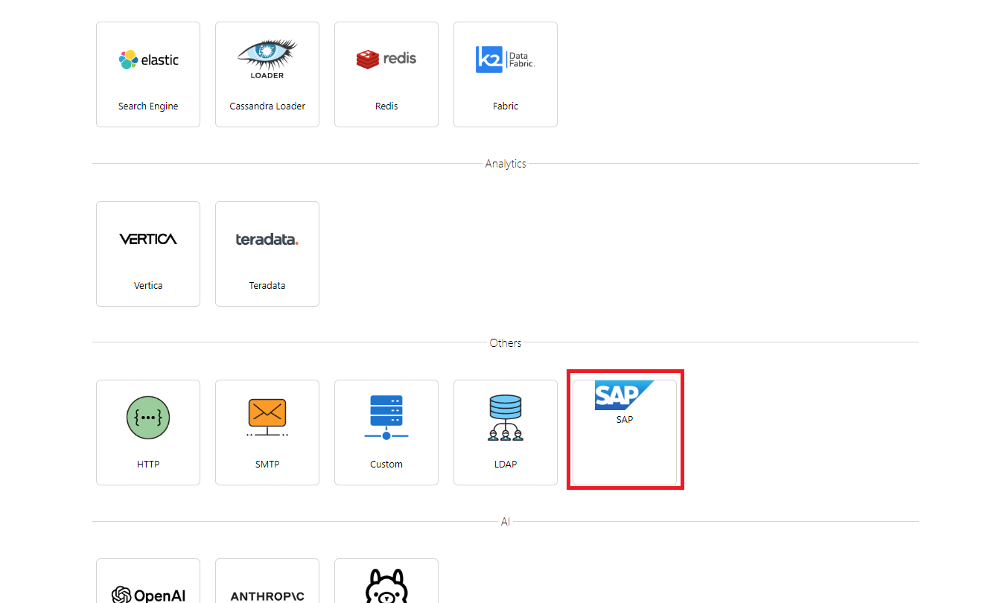

    4) Set the corresponding connection details (host, port, user,
    password, etc.).
    5) SAP Namespace - set to the namespace where the SAP code was
    installed (refer to the *SAP Connector* README document for more
    details) and test the connection
    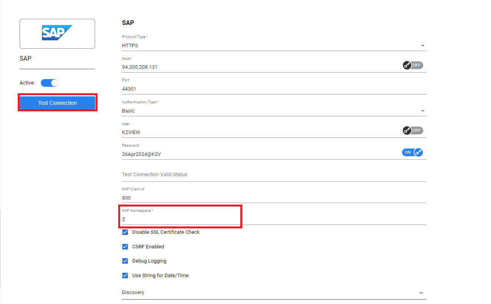

### Step 4: Build a Catalog for the SAP tables

> Note: The SAP Connector is built on top of the Catalog, therefore this step is necessary, otherwise you will not be able to see the tables in the Interface Explorer.

1. The tables listed in the data_platforms must include the schema name (Category). If the Category is unknown, use \"\*\" as a wildcard to represent the schema.
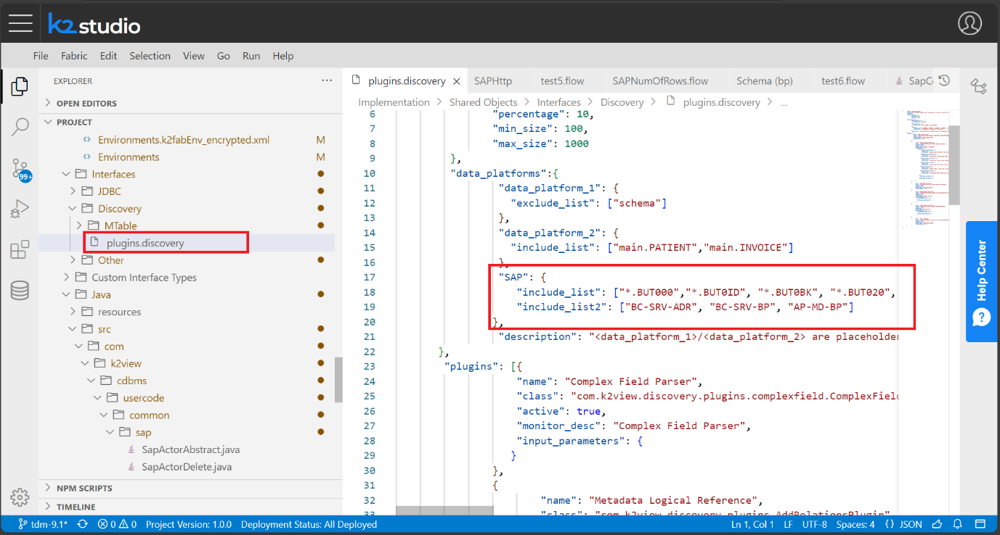

2. Run SAP Discovery: Navigate to Project -\> Implementation -\> Shared Objects -\> Interfaces -\> Other. Right-click the SAP interface you intend to run the Catalog on and select 'Run Discovery Job'
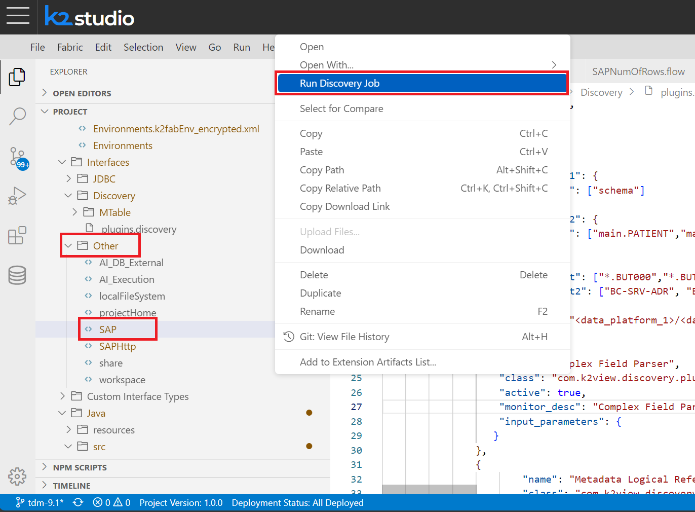

3. After the Discovery job has been completed, navigate to the Catalog tab, click on Actions -\> Build Artifacts

4.  **Note:** The SAP field definitions are strict with their size; if you decide to mask some of the fields, make sure that the generated values do not exceed their size as defined in SAP (you can check the size in the 'Column Size' in the 'catalog_field_info' MTable located under Implementation -\> Shared Objects -\> Interfaces -\> Discovery -\> MTable).

### Step 5: Create and test SAP LU
1. Create a new LU:
    - Navigate to Project -\> Implementation.
    - Right-click on Logical Units / Data Product and select 'New Data Product (Logical Unit)...'.
    - Name the new Logical Unit and select the default type.
2. Add SAP tables to the LU Schema:
    - Open the schema of the newly created LU.
    - Navigate to the INTERFACE EXPLORER tab.
    - Open the SAP interface and locate the SAP tables to be added.
    - Right-click to add tables to the LU Schema.
    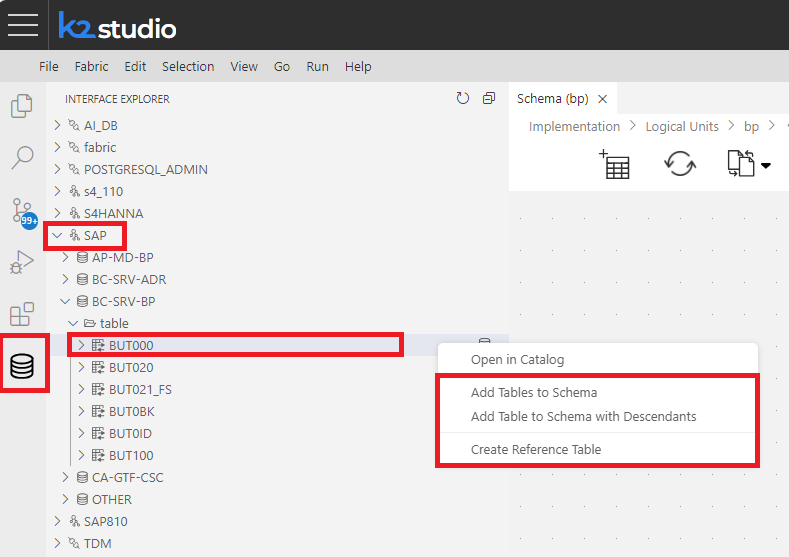

3.  Test your SAP LU with a sample entity.

### Step 6: Build the complete LU with all the schemas of SAP and connect between the different tables (from all your required categories).

### Step 7: Set TDM for your SAP LU

1.  Environment settings:
    1.  Create source and target environments: Navigate to Project -\> Implementation -\> Shared Objects -\> Environments. Open Environments.
    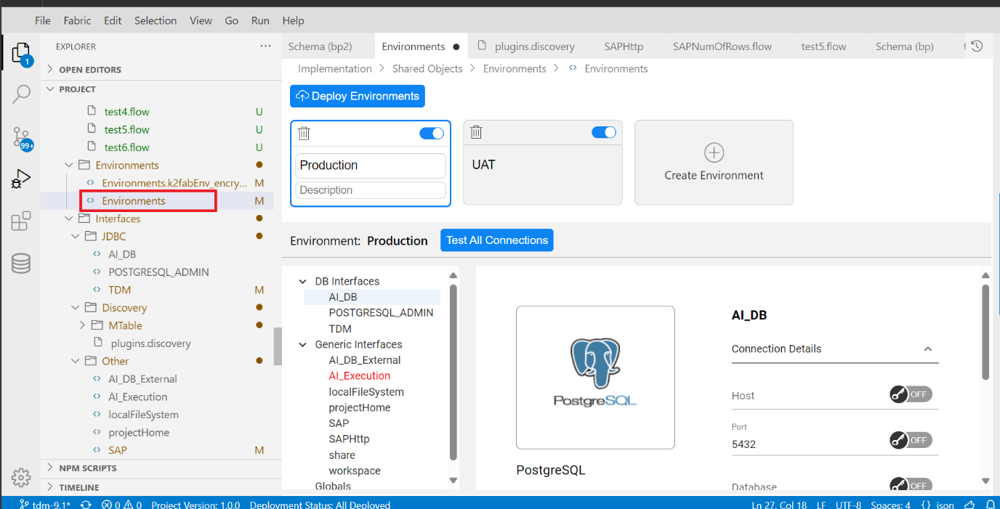
    2. Set interfaces (POSTGRESQL_ADMIN, TDM, SAP) for those environments, and test all interfaces to validate that they are working properly.
    3. Press 'Deploy Environments'.
2.  Run TDMLUInit flow: Navigate to Project -\> Implementation -\> Shared Objects -\> Broadway -\> TDM -\> TDMLUInit. Open the TDMLUInit.flow and run it with the corresponding arguments. As a result, the following flows will be created, using SAP actors: Load flows, Delete flows, Generator flows (the last two flows are created only if specified in the arguments).
    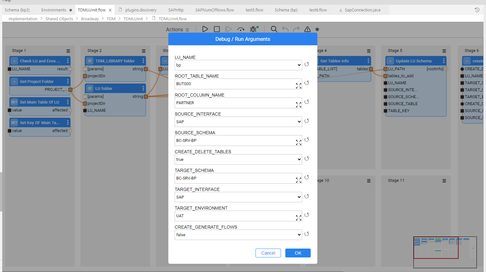
3.  Test your SAP LU with a sample entity.

# How to upgrade to a new TDM version

1. Navigate to the extensions Tab and in the extension of TDM choose
    'Install Another Version\...'
    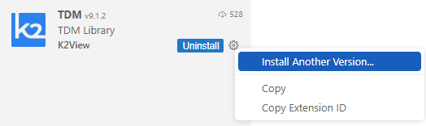

2. Install the corresponding version of *SAP for TDM* in the same way. Verify that the version of *SAP for TDM* that you are installing is compatible with the new TDM version.

3. If you get the below conflict warning, then choose 'Overwrite All'
    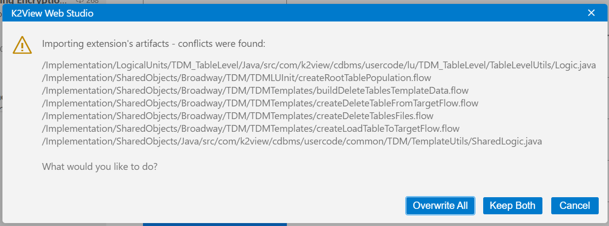

4. If you need to install another *SAP Connector* version, you will need to downgrade it as below:
    - Navigate to the extension Tab and in the SAP Connector extension select: 'Install Another Version...'
        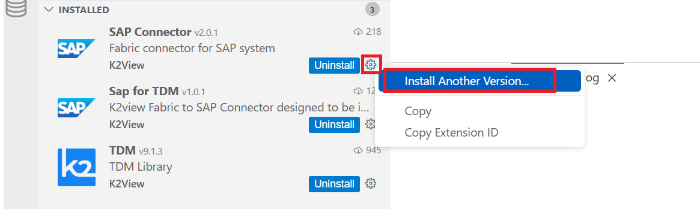
    - Choose the corresponding one (for example: if you are working with Fabric 8.1 the corresponding version will be 1.0.2)
    - If you get the below warning, select 'Keep Changes':
        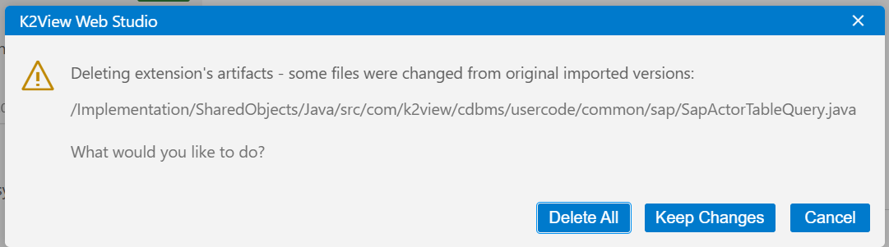
    - And then in the next warning select 'Keep Both':
        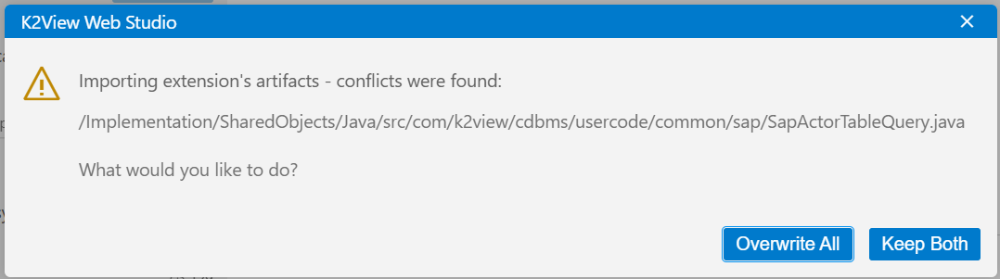
    - Navigate to Implementation -\> Shared Objects -\> Java -\> src -\> com -\> k2view -\> cdbms -\> usercode -\> common -\> sap. Delete the file 'SapActorTableQuery.java.new'
    - Refresh the page

# How to use

### TDMLUInit

Running the TDMLUInit with an LU that uses the SAP Connector,
automatically all the new flows that will be created (Load flows, Delete
flows and Generator flows) will be built-in with the SAP Connector
actors. There is no need to do something special.
> **Note**: If you want to use sequences, create them before running TDMLUInit (see details below).

### TDM Table Level

Inside the SAP for TDM extension, there are special flows for SAP in the
TDM Tables LU and everything should work automatically when doing TDM
Table level tasks. The only thing you need to set is the SAP interface
(or the name you chose for the interface) in the TableLevelInterfaces
MTable (Navigate to Implementation -\> Logical Units -\> References -\>
MTable -\> TableLevelInterfaces.csv): set the Supress_indicator to false
and the Truncate_indicator to false as well.

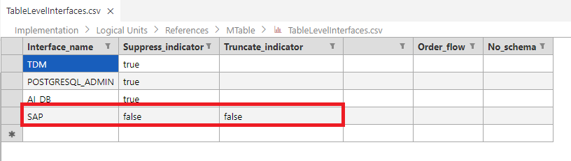

### Synthetic data

SAP for TDM supports synthetic data generation (Rule based generation TDM task). 
In order to get the generator flows, in TDMLUInit set 'CREATE_GENERATE_FLOWS' to true before running it.
> **Note**: It is very important to set a classification for every field according to the Column Size in catalog_field_info MTable, otherwise the default will be a random string of size 10-15(which can cause size
> conflicts in SAP). 

### Sequences

SAP masking sequences ensure consistent and traceable document numbering
by leveraging dynamic elements such as dates and incremental values.
This mechanism simplifies reporting, enhances traceability, and reduces
errors in complex SAP environments.

A built-in flow, called SAP_Get_Initial_Sequence_Value, is available for
handling sequences. Open this flow and populate the parameters as
required.

The SapSequence actor will call the API with the provided parameters and
return the next available sequence value in the range. This value will
serve as the initial value, and TDM will manage the sequences from this
point forward.

> **Note:** In TDM, only the numeric non-external number range objects are supported. 

#### How to Use

- Step 1: Create an initial Broadway flow which includes only one state with the SapSequence actor and fill the inputs (see the description of the actor for more details on the inputs).
- Step 2: Open the TDMSeqList.actor and configure the following as needed at the table input:
    - SEQUENCE_NAME: Specify the name of your sequence.
    - SEQUENCE_REDIS_OR_DB: TDM.
    - INITIATE_VALUE_OR_FLOW: The initial flow you created in step 1.

- Step 3: Open the TDMSeqSrc2TrgMapping.actor and configure the following as needed at the table input:
    - Define the fields as needed by your Logical Unit (LU) relations.
    - Under SEQUENCE_NAME, provide the same sequence name as used in TDMSeqList.actor.

For further details about TDMSeqList and TDMSeqSrc2TrgMapping, refer to the link below [TDM Implementation Using Generic Flows \| K2View Support](https://support.k2view.com/Academy/articles/TDM/tdm_implementation/11_tdm_implementation_using_generic_flows.html#step-2---create-sequences) (Step 2 - Create Sequences)

- Step 4: Run the TDMLUInit.flow to implement the new sequence in TDM.

#### Verifying the Sequence Masking Creation:

After running the TDMLUInit.flow, go to the Sequences folder (Navigate to Implementation -\> Shared Objects -\> Broadway -\> Sequences). You should see the created sequence. Tasks associated with your LU will now display the new sequence in the TargetID field.

## Changelog

### v1.0.2

### Fixed
- Count number of rows in Table-Level load.
- Add missing inner-flow used by table-level load flow. 

#### Added
- Added Table-Level Delete flow.

#### Changed
- Moved README.md to a separate git repository.
  
### v1.0.1
#### Changed
- Overwrite `SapTableQuery` actor that comes with `Sap Connector` in order to use `TDMSourceDbQuery` instead of `SourceDbQuery` - needed for proper synthetic data generation in TDM.
### v1.0.0
#### Changed
- Adapted the code and tested it on TDM 9.1.3
